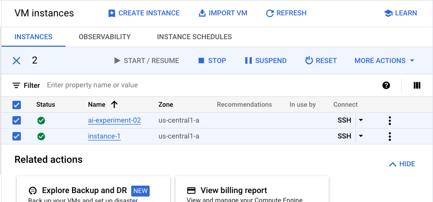
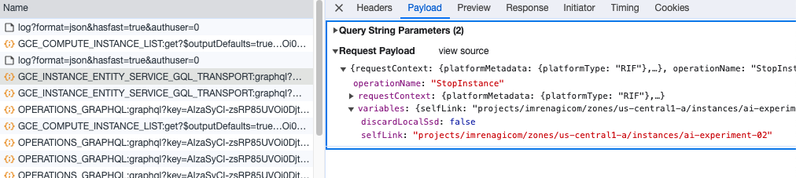
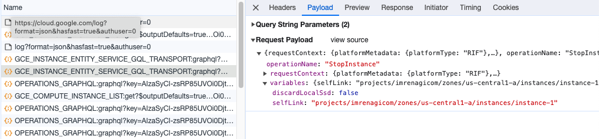
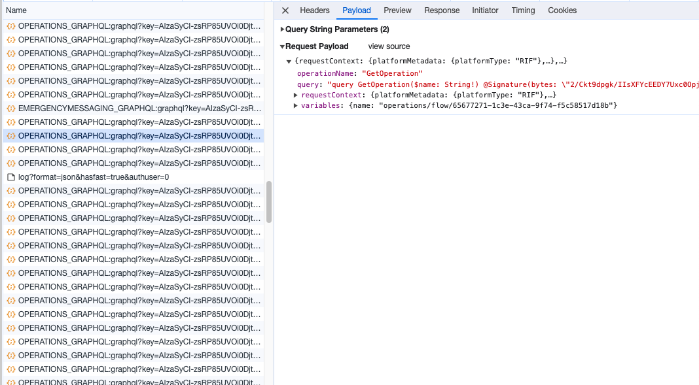

# Thinking about API

Couple weeks ago, I made comment about how I think about designing API. I think it is worth to write it down here. 

> API contract which simply follows frontend implementation is a design mistake. [Source](https://twitter.com/imrenagi/status/1721510844121415698)

Before I go to more detail about this, let's take a look at an example. Image you see below is user interface from Google Cloud Compute Engine which shows list of instances.



As you can see, there are two GCE instances being checked. If you click stop action, it will send request to the server to stop the instance. Question is, how many API calls will be made to the server to delete these two instances?

If you are thinking that it will make one API call for stopping all instances, you are wrong. It will make two API calls. One for each instance. Here is the proof:




If you observe, there are two API calls made to the server. One for each instance.

Let's stop. Why is that? Why not just make one API call which contains list of instances to be stopped? In this case, user will just press stop button once, why bother making n number of API calls to stop n number of instances?

> To be honest, I don't know the exact reason because I'm not the one designed this and primarily I'm not working at Google. But let me explain why I think this makes sense.

The API call you see there is actually API call made by browser to the UI server side. It is not even a direct call to the [GCE API](https://cloud.google.com/compute/docs/reference/rest/v1) backend. 

From the [instance stop API](https://cloud.google.com/compute/docs/reference/rest/v1/instances/stop), we know that we can only stop one instance at a time. 

```
POST https://compute.googleapis.com/compute/v1/projects/{project}/zones/{zone}/instances/{instance}/stop
```

For each API call for stopping the instance, it returns `Operation` resource which can be used later to track whether the operation is completed or not (detail [here](https://cloud.google.com/compute/docs/reference/rest/v1/instances/stop#response-body)). 

If you look carefully, these API design is made not to follow how the UI is implemented. Instead, it follows the nature of the business process. In this case it is about how GCP manages its instance stop. When you are stopping or even deleting the instance, each process is done asynchronously and independently. Being said, each instance stop and can be tracked and done separately. 

Now, think about how you should provide the response back to tell whether stop can be done eventually for all instances when the client only send a single request to stop or delete multiple instances? Are you gonna do something like this?

```json
{
  "results": [
    {
      "id": "instance-1",      
      "operation": {
        "id": "operation-1",
        "status": "pending"
      }
    },
    {
      "id": "instance-2",
      "operation": { ... }
    },
    {
      "id": "instance-3",
      "operation": { 
        "id": "operation-3",
        "status": "failed",
        "error": "can't stop instance-3"
      }
    }
  ]
}
```

What happened if one of the instance can't be stopped? Are you still returning 200 status code and continue stopping the rest of the instance that can be stopped properly? To me, it is clear that this is not the right way to do it. 

Another issue spotted? Imagine you are trying to stop 100 or 1000 instances at once. How long are you going to wait until you get the operation response constructed for all instances? Boom!

_That's where we need Backend for Frontend_

Hmmmm... I might not 100% agree on that.

Backend for Frontend (BFF) is a pattern where you create a backend service which is specifically designed to serve a particular frontend. [Source](https://samnewman.io/patterns/architectural/bff/). In the example above, I might argue that the UI server itself is already a BFF. It is designed to serve the UI on the browser. But still, the API made from the client side is still one to one mapping to the backend API. It might aggregate something else, but not for stopping multiple instances at once.

Then why? 

Take a look at this polling request made by the browser to the server to check whether the operation is completed or not.



For each instance deletion, client side performed polling to the server to check whether the operation is completed or not. This is simply used to check whether UI state for each instance can be updated or not with completion or failure status. I really think it is an UX matter where it follows the UI needs.

So, I hope you can start see it. Everything here is just tradeoff. In one hand, you favor the simplicity so that you can design clean and simple business process while sacrificing ui performance by making multiple calls. In the other hand, you favor the UX by doing polling to the server to check the status of the operation while sacrificing the number of requests need to be made from frontend (you can use websocket though, but is it worth it?).

Damn! We haven't talked about flexibility for various type of clients using the API yet. While keeping the API simple, somehow you provide flexibility for the client to do whatever they want. This might be something that we can discuss in another post. But, I hope you get the idea. Don't simply follow how the UI is implemented. Instead, think about the business process and how you can make it simple and flexible for the client to use.